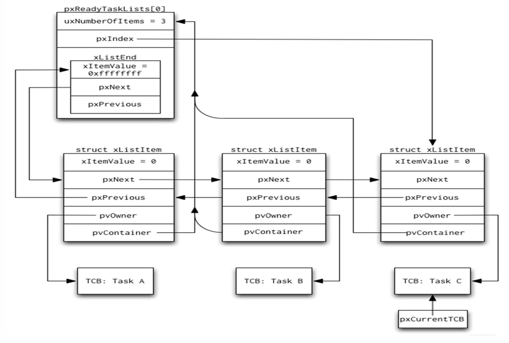

# FreeRTOS Lab2

## Requirement

Lab2 requires to create four FreeRTOS tasks: `Red_LED_App`, `Green_LED_App`, `Delay_App`, and `TaskMonitor_App`. Among them, the `TaskMonitor_App` is responsible for periodically invoking the `Taskmonitor()` function. This function should traverse the system’s internal task lists, including `ReadyTaskList`, `DelayedTaskList`, and `OverflowDelayedTaskList`. For each task found, the system should print its Task Control Block (TCB) information via `UART`. Furthermore, the printed information must include the task's name, priority, stack pointer, top of stack pointer, and current task state.

e.g. 
| Name | Priority(Base/Actual) | pxStack | pxTopOfStack | State |
|------|-----------------------|---------|--------------|-------|
| IDLE        | 0/0   | 0x20000a48 | 0x20000bec | Ready    |
| TaskMonitor | 3/3   | 0x200000a8 | 0x2000022c | Ready    |
| Red_LED     | 1/1   | 0x20000310 | 0x20000494 | Blocked  |
| Green_LED   | 1/1   | 0x20000578 | 0x200006fc | Blocked  |
| Delayed_App | 14/14 | 0x200007e0 | 0x20000964 | Overflow |

## Priority settings

`Red_LED_App`, `Green_LED_App` set as 1
```C
xTaskCreate(Red_LED_App, "Red_LED_App", 256, NULL, 1, NULL);
xTaskCreate(Green_LED_App, "Green_LED_App", 256, NULL, 1, NULL);
```

`Delay_App` sets as 14
```C
xTaskCreate(Delay_App, "Delay_App", 256, NULL, 14, NULL);
```
`TaskMonitor_App` sets as 3 as well as a larger size of stack depth
```C
xTaskCreate(TaskMonitor_App, "TaskMonitor_App", 500, NULL, 3, NULL);
```

## What should be added in main.c

### TaskMonitor_App

```C
void TaskMonitor_App(void *pvParameters) {
	for(;;) {
		Taskmonitor();
		vTaskDelay(1000);
	}
}
```

### Red_LED_App

```C
void Red_LED_App(void *pvParameters) {
	uint32_t Redtimer = 800;
	for(;;){
		HAL_GPIO_TogglePin(GPIOD, Red_LED_Pin);
		vTaskDelay(Redtimer);
		Redtimer+=1;
	}
}
```

### Green_LED_App

```C
void Green_LED_App(void *pvParameters) {
	uint32_t Greentimer = 1000;
	for(;;){
		HAL_GPIO_TogglePin(GPIOD, Green_LED_Pin);
		vTaskDelay(Greentimer);
		Greentimer+=1;
	}
}
```

### Delay_App

```C
void Delay_App(void *pvParameters){
	int delayflag=0;
	uint32_t delaytime;
	while(1) {
		if(delayflag==0){
			delaytime=1000;
			delayflag=1;
		} else {
			delaytime=0xFFFFFFFF;
		}
		vTaskDelay(delaytime);
	}
}
```

## UART (Universal Asynchronous Receiver/Transmitter)
In FreeRTOS, UART is commonly used for debugging and monitoring purposes. It allows tasks to send messages to external terminals (such as serial monitors) for logging system states, printing variable values, or displaying task-related information. This is especially helpful in embedded systems without screens.

### How you transmit information via UART
```C
HAL_StatusTypeDef HAL_UART_Transmit(UART_HandleTypeDef *huart, const uint8_t *pData, uint16_t Size, uint32_t Timeout);
```

| argument | Description |
|----------|-------------|
| huart | Pointer to a UART_HandleTypeDef structure that contains the configuration information for the specified UART module. |
| pData | Pointer to data buffer. |
| Size | The amount of data elements to be sent. |
| Timeout | Timeout duration. |

e.g.
```C
HAL_UART_Transmit(&huart2, (uint8_t *)buffer, strlen(buffer), 0xffff);
```

## List 
In FreeRTOS, List is used to organize and manage tasks and system objects such as timers or event groups. It helps the scheduler keep track of task states (e.g., ready, delayed, or blocked) by storing tasks in specific lists like the ReadyList, DelayedList, and SuspendedList. Each list allows the kernel to efficiently select the next task to run or determine when a task should be unblocked.



### xLIST_ITEM

```C
struct xLIST_ITEM
{
    configLIST_VOLATILE TickType_t xItemValue;
    struct xLIST_ITEM * configLIST_VOLATILE pxNext;
    struct xLIST_ITEM * configLIST_VOLATILE pxPrevious;
    void * pvOwner;
    struct xLIST * configLIST_VOLATILE pxContainer;
};
typedef struct xLIST_ITEM ListItem_t;
```

### Macro in List.h
```C
/*
 * Access macro to get the owner of a list item.  The owner of a list item
 * is the object (usually a TCB) that contains the list item.
 *
 * \page listSET_LIST_ITEM_OWNER listSET_LIST_ITEM_OWNER
 * \ingroup LinkedList
 */
#define listGET_LIST_ITEM_OWNER( pxListItem )	( ( pxListItem )->pvOwner )

/* Add new macro for lab2 */
#define listGET_ITEM_OF_HEAD_ENTRY( pxList ) ( (&( ( pxList )->xListEnd ))->pxNext )
```

## Manage the printed information via UART

This is a simplified `UART` transmission function. It takes a string `msg` and sends it via `HAL_UART_Transmit` using `UART2`.
```C
void uartPrint(const char *msg) {
	HAL_UART_Transmit(&huart2, (uint8_t *)msg, strlen(msg), 0xffff);
}
```

This is the core task monitoring function. It performs the following:

* Suspend the Scheduler: Calls `vTaskSuspendAll()` to prevent task list changes during traversal.

* Print Header: Sends a formatted header row via `UART`.

* Print Ready Tasks: Iterates through all priority levels of the Ready List and prints task information such as name, priority, and stack pointers.

* Print Delayed Tasks: Outputs tasks that are currently in a Blocked state.

* Print Overflow Tasks: Outputs tasks in the Overflow Delayed List.

* Resume Scheduler: Calls `xTaskResumeAll()` to resume normal scheduling operations.

```C
void Taskmonitor(void) {
	char buf[150];

	// Suspend scheduler
	vTaskSuspendAll();

	sprintf(buf, "| %-10s | %-8s | %-10s | %-12s | %-8s |\n\r",
	        "Name", "Base/Act", "pxStack", "pxTopOfStack", "State");
	HAL_UART_Transmit(&huart2, (uint8_t *)buf, strlen(buf), 0xffff);

	// ----------- Ready List -----------
	for (int prio = 0; prio < configMAX_PRIORITIES; prio++) {
		if (!listLIST_IS_EMPTY(&pxReadyTasksLists[prio])) {
			ListItem_t *item = listGET_ITEM_OF_HEAD_ENTRY(&pxReadyTasksLists[prio]);
			while (item != (ListItem_t*)&(pxReadyTasksLists[prio].xListEnd)) {
				TCB_t *tcb = (TCB_t *)listGET_LIST_ITEM_OWNER(item);
				sprintf(buf, " %-10s  %2d /%-5d  0x%08lx  0x%08lx  %-8s \n\r",
					tcb->pcTaskName,
					tcb->uxBasePriority,
					tcb->uxPriority,
					tcb->pxStack,
					tcb->pxTopOfStack,
					"Ready");
				uartPrint(buf);
				item = item->pxNext;
			}
		}
	}

	// ----------- Delayed List -----------
	if (!listLIST_IS_EMPTY(pxDelayedTaskList)) {
		ListItem_t *item = listGET_ITEM_OF_HEAD_ENTRY(pxDelayedTaskList);
		while (item != (ListItem_t*)&(pxDelayedTaskList->xListEnd)) {
			TCB_t *tcb = (TCB_t *)listGET_LIST_ITEM_OWNER(item);
			sprintf(buf, " %-10s  %2d /%-5d  0x%08lx  0x%08lx  %-8s \n\r",
				tcb->pcTaskName,
				tcb->uxBasePriority,
				tcb->uxPriority,
				tcb->pxStack,
				tcb->pxTopOfStack,
				"Blocked");
			uartPrint(buf);
			item = item->pxNext;
		}
	}

	// ----------- Overflow Delayed List -----------
	if (!listLIST_IS_EMPTY(pxOverflowDelayedTaskList)) {
		ListItem_t *item = listGET_ITEM_OF_HEAD_ENTRY(pxOverflowDelayedTaskList);
		while (item != (ListItem_t*)&(pxOverflowDelayedTaskList->xListEnd)) {
			TCB_t *tcb = (TCB_t *)listGET_LIST_ITEM_OWNER(item);
			sprintf(buf, " %-10s  %2d /%-5d  0x%08lx  0x%08lx  %-8s \n\r",
				tcb->pcTaskName,
				tcb->uxBasePriority,
				tcb->uxPriority,
				tcb->pxStack,
				tcb->pxTopOfStack,
				"Overflow");
			uartPrint(buf);
			item = item->pxNext;
		}
	}

	// Resume scheduler
	xTaskResumeAll();
}
```

